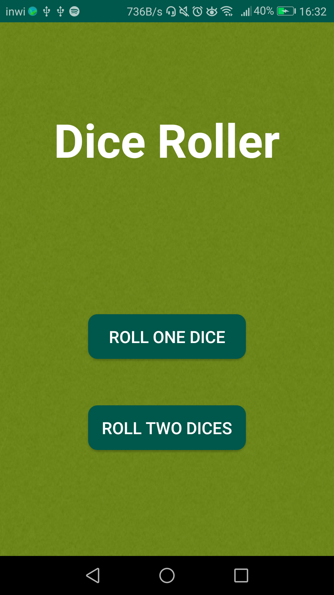
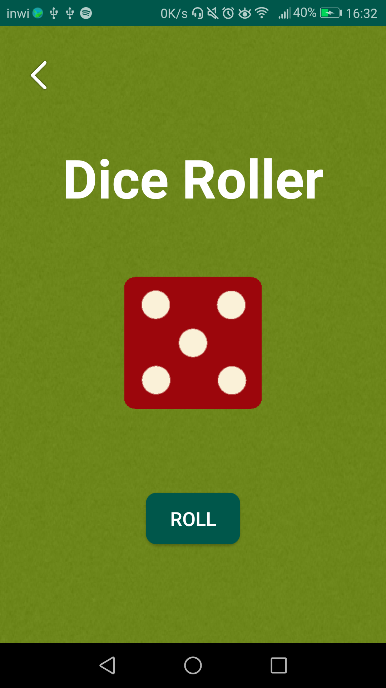
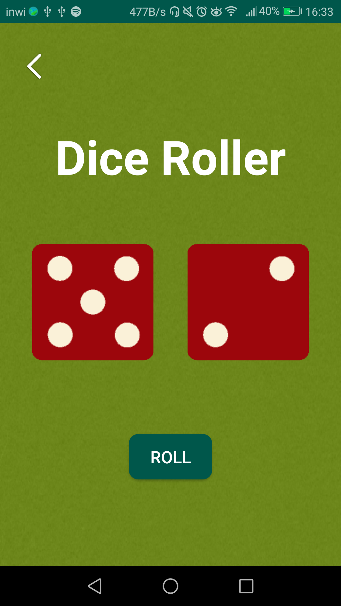

# Dice-Roller-App

Simple Dice roller app to practice **java** and **android basics** plus what i've learned in a udemy course during **COVID-19 quarantine**.

### What i've learned:
* Figuring out what Gradle is used for
* Working and manipulating differents layouts..
* Working with math.random to generate numbers between [1-6] and updating image views.
* Navigating between activities using intents and OnclickListeners
* How images and icons are added to the workspace
* Debugging and printing log messages..
* Using version controls 

and much more basics that will help me on future projects...

## Screenshots:

  

**Home Menu:**

  

If The Button **Roll One Dice** is clicked:

  

If The Button **Roll Two Dices** is clicked:

  

Enjoy Rolling :stuck_out_tongue_winking_eye: 
